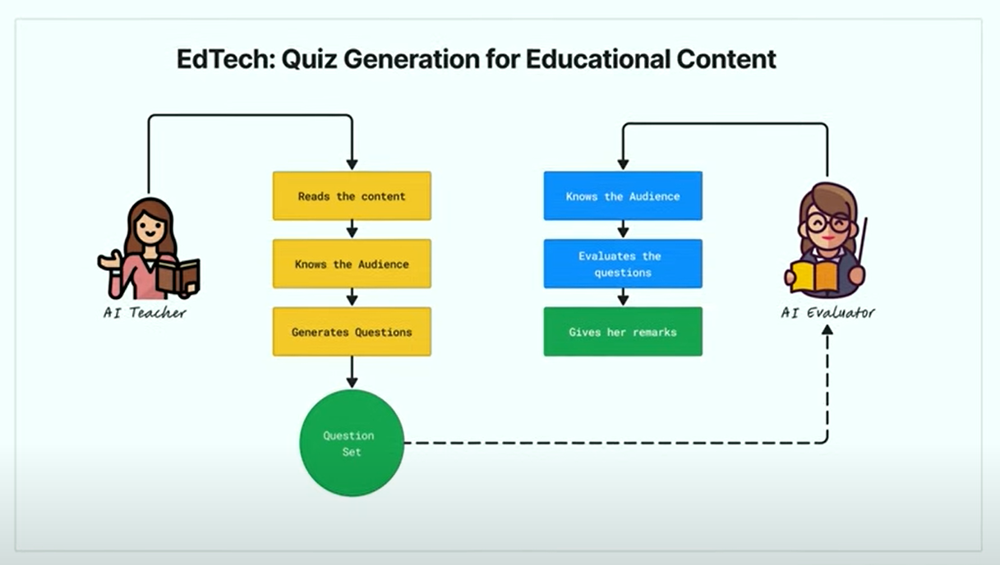
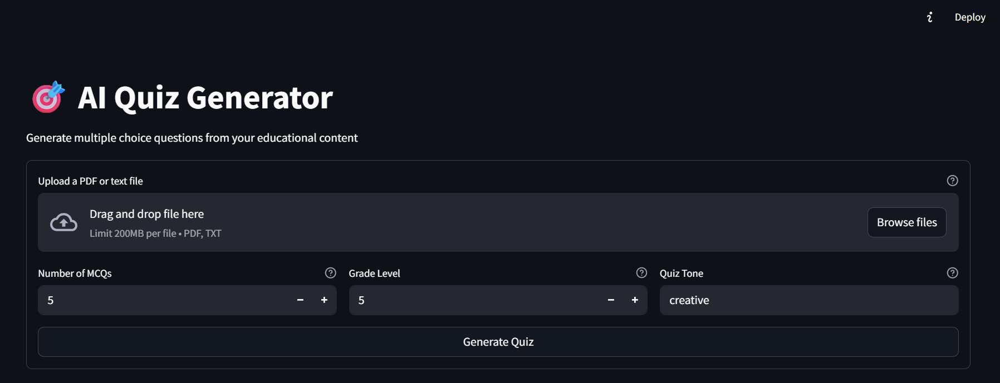
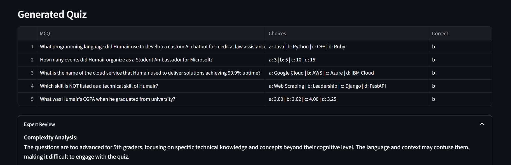

# EdTech - Quiz Generation for Educational Content



## AI quiz generator, mixure of AI teacher for quiz creation and AI evaluator for generated quiz according to the selected grade of the students. Built using Python, LangChain, OpenAI API, and Streamlit.





## Setting up the Project

```bash
# Make sure you have Python and Git installed on your machine
# Clone the repo in your respective folder
$ git clone https://github.com/humairshoukat/Quiz-AI

# After successfully cloning the repo, go to the project folder
$ cd Quiz-AI

# Setup the virtual environment
$ python -m venv venv

# Activate the virtual environment
$ venv\Scripts\activate  # For Windows
$ source venv/bin/activate  # For Mac & Linux

# If you're unable to activate the venv, OR if you get the error that running/execution scripts are disabled,
# If you're using Windows, fix it by following the instructions below:
# Open your Windows PowerShell by running it as Administrator and run the following command and enter 'Y':
$ Set-ExecutionPolicy RemoteSigned
# The issue will get fixed. Now, activate the virtual environment again and follow the next instructions.

```

## Running the Project

```bash
# Install the requirements
$ pip install -r requirements.txt

# Create a .env file by using the example .env file from the project files (No need if there is no example .env file)

# Run the app
$ streamlit run app.py

# You can access the app on the following URL
$ http://localhost:8501/

```
